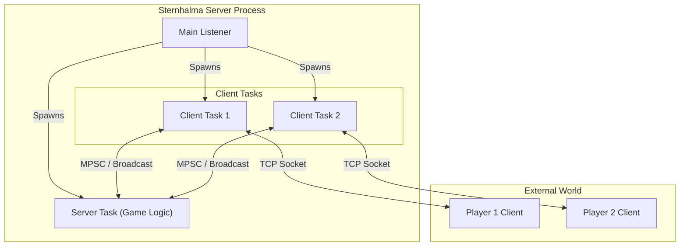

# Sternhalma game server

## The Sternhalma game

The game is played on an hexagonal board in the shape of a six point star with
121 valid positions.
Each player has 15 pieces and start on the opposite sides of the board.
The pieces are represented by colored circles, one color for each player.

```text
   󠀠󠀠󠀠󠀠   󠀠󠀠󠀠󠀠   󠀠󠀠󠀠󠀠   󠀠󠀠󠀠󠀠     󠀠󠀠󠀠󠀠   󠀠󠀠󠀠󠀠   🔴
    󠀠󠀠󠀠󠀠   󠀠󠀠󠀠󠀠   󠀠󠀠󠀠󠀠   󠀠󠀠󠀠󠀠     󠀠󠀠󠀠󠀠   🔴 🔴
  󠀠󠀠󠀠󠀠   󠀠󠀠󠀠󠀠   󠀠󠀠󠀠󠀠   󠀠󠀠󠀠󠀠   󠀠󠀠󠀠󠀠     🔴 🔴 🔴
   󠀠󠀠󠀠󠀠   󠀠󠀠󠀠󠀠   󠀠󠀠󠀠󠀠   󠀠󠀠󠀠󠀠   󠀠󠀠󠀠󠀠  🔴 🔴 🔴 🔴
   ⚫ ⚫ ⚫ ⚫ 🔴 🔴 🔴 🔴 🔴 ⚫ ⚫ ⚫ ⚫
  󠀠󠀠󠀠󠀠   ⚫ ⚫ ⚫ ⚫ ⚫ ⚫ ⚫ ⚫ ⚫ ⚫ ⚫ ⚫
   󠀠󠀠󠀠󠀠   ⚫ ⚫ ⚫ ⚫ ⚫ ⚫ ⚫ ⚫ ⚫ ⚫ ⚫
       ⚫ ⚫ ⚫ ⚫ ⚫ ⚫ ⚫ ⚫ ⚫ ⚫
  󠀠󠀠󠀠󠀠   󠀠󠀠󠀠󠀠   ⚫ ⚫ ⚫ ⚫ ⚫ ⚫ ⚫ ⚫ ⚫
   󠀠󠀠󠀠󠀠   ⚫ ⚫ ⚫ ⚫ ⚫ ⚫ ⚫ ⚫ ⚫ ⚫
    ⚫ ⚫ ⚫ ⚫ ⚫ ⚫ ⚫ ⚫ ⚫ ⚫ ⚫
  ⚫ ⚫ ⚫ ⚫ ⚫ ⚫ ⚫ ⚫ ⚫ ⚫ ⚫ ⚫
⚫ ⚫ ⚫ ⚫ 🔵 🔵 🔵 🔵 🔵 ⚫ ⚫ ⚫ ⚫
 󠀠󠀠󠀠󠀠   󠀠󠀠󠀠󠀠   󠀠󠀠󠀠󠀠   󠀠󠀠󠀠󠀠   🔵 🔵 🔵 🔵
  󠀠󠀠󠀠󠀠   󠀠󠀠󠀠󠀠   󠀠󠀠󠀠󠀠   󠀠󠀠󠀠󠀠   🔵 🔵 🔵
   󠀠󠀠󠀠󠀠   󠀠󠀠󠀠󠀠   󠀠󠀠󠀠󠀠   󠀠󠀠󠀠󠀠   🔵 🔵
    󠀠󠀠󠀠󠀠   󠀠󠀠󠀠󠀠   󠀠󠀠󠀠󠀠   󠀠󠀠󠀠󠀠   🔵
```

The game is turn based and a player can move one piece per turn.
A piece can be moved to an adjacent empty position or jump over an arbitrary
number of single pieces from any player.

The goal of the game is to move all one's pieces to the opposite side of the board.

The goal of the game is to move all one's pieces to the opposite side of the board.

## Web Client

A React-based web client is available in the `web-client` directory. It uses the WebSocket protocol to communicate with the server.

To run the web client:

```bash
cd web-client
npm install
npm run dev
```

## Architecture

The server is built using **Rust** and **Tokio**, leveraging an asynchronous, actor-like architecture to ensure high performance and scalability. This design decouples connection handling/IO from the core game logic.

### Key Components

* **Main Task**: Responsible for initializing the server, binding the Unix Listener, and accepting incoming connections. For each connection, it spawns a dedicated Client Task.
* **Server Task**: The central authority of the game session. It maintains the `Game` state, validates moves, manages turn order, and broadcasts updates to all clients.
* **Client Task**: Acts as a bridge between the Server Task and the external Player (remote client). It handles serialization/deserialization of network messages and forwards requests/events between the socket and the internal channels.

### Scalability & Design Philosophy

The server is designed to be **client-agnostic**. It does not enforce any specific UI implementation; any client (CLI, TUI, GUI, AI agent) that implements the communication protocol can connect and play.

Due to its asynchronous nature, the server handles I/O efficiently, sleeping when idle. While currently configured for a single game session, the architecture is designed to support **multiple concurrent game sessions** in future iterations, where a central "Lobby" actor could spawn independent Server Tasks for each match.



## Communication Protocol

The server supports two concurrent transport modes:

1. **Raw TCP**: Legacy binary protocol.
2. **WebSocket**: Modern web-compatible protocol (defaulting to port 8081).

Both transports use the same message format serialized with [ciborium](https://github.com/enarx/ciborium) (CBOR).

For a detailed specification of the protocol, framing, and message schemas, please refer to [protocol.md](docs/protocol.md).

### Connection & Framing

#### Raw TCP

* **Transport**: TCP Socket
* **Framing**: Length-prefixed. Every message is prefixed with a **4-byte big-endian unsigned integer** representing the length of the CBOR-encoded payload.
  * `[Length (u32 BE)] [CBOR Payload]`

#### WebSocket

* **Transport**: HTTP/1.1 Upgrade to WebSocket
* **Framing**: Standard WebSocket binary frames containing the CBOR payload (no length prefix needed).

### Messages

All messages are strictly typed and use the `snake_case` convention.

#### RemoteInMessage (Client -> Server)

* `{ "type": "hello" }`: Request to start a new game/session.
* `{ "type": "reconnect", "session_id": "UUID_STRING" }`: Request to resume an existing session.
* `{ "type": "choice", "movement_index": INTEGER }`: Submit a move (index into the list of available moves provided by the server).

#### RemoteOutMessage (Server -> Client)

* `{ "type": "welcome", "session_id": "UUID_STRING" }`: Successful connection/reconnection.
* `{ "type": "reject", "reason": "STRING" }`: Connection/reconnection failed.

* `{ "type": "disconnect" }`: Server is shutting down the session.
* `{ "type": "turn", "movements": [ [ [q1, r1], [q2, r2] ], ... ] }`: It is your turn. Contains a list of valid moves (start and end hex coordinates).
* `{ "type": "movement", "player": "Player1" | "Player2", "movement": [[q1, r1], [q2, r2]], "scores": [s1, s2] }`: Broadcast of a valid move made by a player.
* `{ "type": "game_finished", "result": GameResult }`: The game has ended.

## Development & Testing

This project includes a comprehensive integration test suite to verify server behavior, network protocol, and game logic.

### Running Tests

```bash
cargo test
```

### Test Suite Overview

* **Connection Tests** (`tests/connection.rs`):
  * Verifies successful TCP connection and handshake.
  * Ensures the server correctly handles multiple players (up to the limit).
  * Tests rejection of excess players beyond the game capacity.
* **Gameplay Tests** (`tests/gameplay.rs`):
  * Simulates a full game cycle: connection, turn assignment, move submission, and state broadcasting.
  * Verifies that moves are validated and correctly propagated to all clients.
* **Reconnection Tests** (`tests/reconnection.rs`):
  * Tests the robustness of the session management.
  * Verifies that a player can disconnect and reconnect with their session ID to resume the game without losing state.

### Usage

The server executable is `sternhalma-server`. It can listen on **Raw TCP**, **WebSocket**, or **both simultaneously**.

```bash
sternhalma-server --max-turns <N> [--tcp <ADDRESS>] [--ws <ADDRESS>]
```

### Arguments

* `--tcp <ADDRESS>`: Bind the **Raw TCP** listener to the specified address (e.g., `127.0.0.1:8080`).
* `--ws <ADDRESS>`: Bind the **WebSocket** listener to the specified address (e.g., `127.0.0.1:8081`).
* `-n, --max-turns <N>`: (Optional) Limit the game to N turns.
* `-t, --timeout <SECONDS>`: (Optional) Connection timeout in seconds (default: 300).
